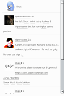

# ELI, Expression Libre Incongrue

## About

This is a javascript widget that permit to show a GNU Social timeline. This works for a user or a group.

   

## License

This program is under the [WTF Public License](http://sam.zoy.org/wtfpl/COPYING 'Read more about the WTF Public License').

## Installation

Just:

  * copy the eli.js in your website directory
  * add this code in your page:

```html
    <div id="elitimeline">
      <p>Timeline activity...</p>
    </div>
```

Then add this code **at the end of your page before the `</body>` tag**:

```html
    <script type="text/javascript" src="./eli.js">
      var type = 'user'; // could be 'group' to follow a group
      var user = 'bl4n';
      var max = 5;
      var tag = 'elitimeline';
      var domain = 'myGNUSocialDomain.tld';
    </script>
```

Adapt domain content by your GNU Social Instance. For an example: **https://quitter.se**.

In order ELI widget to be more beautiful, add this in your CSS file or in **`</style>` tag**:

```css
#eli_widget {
width: 250px;
margin: 0;
padding: 0;
border: thin solid #eee;
border-radius: 12px;
box-shadow: 2px 1px 5px #000;
}

#eli_widget header {
text-align: left;
border-bottom: 5px solid #fb6104;
background-color: #43568e;
border-top-left-radius: 12px;
border-top-right-radius: 12px;
color: #ffffff;
}

#eli_widget header img {
margin: 5px;
background-color: #ffffff;
border-top-left-radius: 12px;
float: left;
}

#eli_widget header p {
margin: 0;
line-height: 60px;
}

#eli_widget article {
display: block;
margin-bottom: 5px;
padding: 5px;
border-bottom: thin solid #eeeeee;
}

#eli_widget article img {
max-width: 240px;
}

#eli_widget article p {
margin-top: 0px;
}

.tooltip {position: relative;}
.tooltip span {display: none;}
.tooltip:hover span {
display: block;
position: absolute;
left: 0; bottom: 120%;
margin: 20px 0 0;
width: 200px;
color: #4D4D4C;
border: thin solid #eeeeee;
padding: 4px;
background: white;
}
```

A more fully CSS example is available in **style.css** file.

You can also check the demo on **minimal.html** page. You can also see a more complete version on **index.html** page.

## Configuration

You probably want to change these variables:

  * type: Add here **user** OR **group** if you want to follow a user OR a group
  * user: Add here the name of the user (or the group) you want to follow
  * max: Add here the number of statuses you want to display. By default StatusNet seems to only give 20 statuses.
  * tag: The name of the tag we should change to display all statuses. In the previous example, the div with ID equal to *content* would be changed. But you can add another ID.
  * domain: The URL of your GNU Social Instance.
  * posttime_label: Change the label name that appears when you have the time the entry was posted.
  * location_label: Change the label name that appears when the entry give a location.

## Read code

**eli.js** is a minimal version of ELI. To have a more readable version, with more options, you can open **eli.max.js** file.

### Howto minify eli.max.js

  * Go to http://javascript-minifier.com/
  * Copy/paste the content of eli.max.js
  * Delete the license, the first lines ```var loadForm``` and the loadConfig() function
  * Click on **Minify**
  * Copy the result into eli.js file

## Contact

You can contact me at the given address: eli [AT] dossmann [DOT] net
